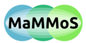

# Magnetic Materials Ontology (MagMO)
EMMO-based domain ontology for magnetic materials.

For an overview of the concepts of the ontology, visit the [Overview](docs/overview.md).

## Imported ontologies
Version dependencies on imported ontologies:

| Version | [EMMO-inferred] |
|---------|-----------------|
| 0.0.4   | 1.0.3           |
| 0.0.5   | 1.0.3           |
| 0.0.6   | 1.0.3           |

## Project
Created within the EU project [MaMMoS](https://mammos-project.github.io/). Grant number 101135546 (HORIZON-CL4-2023-DIGITAL-EMERGING-01).



## Acknowledgement

Funded by the European Union. Views and opinions expressed are however those of the author(s) only and do not necessarily reflect those of the European Union or European Health and Digital Executive Agency (HADEA). Neither the European Union nor the granting authority can be held responsible for them.


```{toctree}
:hidden:
docs/overview.md
```
